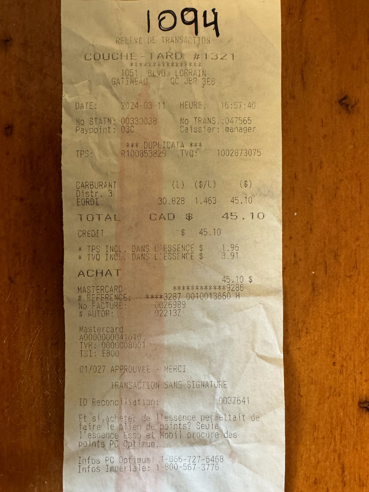

*This tutorial is sponsored by Pixeltable*

As your AI systems become more widely used, you may start to feel the urge to measure and optimize the quality of your prompt(s) (the very foundation on which your entire system relies. I know I did). By the end of this course, you’ll understand exactly what world-class optimizers like DSPy do, how to use DSPy, and how to customize it for your specific needs (for example, optimizing with DSPy and then running the optimized prompt on your own system).

Our focus here is on prompt optimization. While dspy and its creators are world reknowned for prompt optimization this is not actually dspy's focus. DSPy rather focuses on helping *you* building compound AI systems, that is: system where code, control flow, and one or many AI component or interleaved togehter. To build such system tuning (e.i. optimization) is important, thus dspy has very strong tooling to help you optimize prompts, but it's a little bit 'baked it', as dspy does not promise to help you optimize prompt but rather optimize ai systems, as such it can feel a little be black boxy. I have made and I will make more tutorial on who to use DSPy to built compound AI systems and why you should lean into that paradigm as soon as you want to call an AI with code, but in this tutorial, we will focus on the prompt optimization.

This tutorial is in three parts, first we will build our own prompt optimizer, I find that there is no better way to really understand something then to build it ourselves, second we will look how easier and better we can do it using DSPy, and third we will look at how we can customize DSPy to leverage its prompt optimization capabilities while be able to take 'leave' dspy and take that optimized prompt with us.

Our task here will be to build an AI system that can extract information from pictures of invoices.

# Building a Simple Prompt Optimizer

Let’s start by building our own prompt optimizer, by hand! To optimize a prompt automatically we need a target, we need to know what is the intent of the system. Intent, can be specified in many way: 1) by example, with a goldset, 2) by a rubric or judge, 3) by instructions and/or 4) by stating the input/output. See [this post to read more about that](https://maximerivest.com/posts/on-building-ai-programs.html) to learn more. For now, we will build an optimizer that using (1) and (3) and in our code we will use the examples (1) to measure our progress. DSPy has optimizers that provides all 4 sources of intents to AI to optimize the system.

Ok so here is the high level steps we will take:

TODO


## The Task

Our task here will be to build an AI system that can extract information from pictures of invoices.



For instance, on the above invoice the after tax amount is 45.10 CAD but the before tax is not written it must be calculated as `45.10 − 1.96 − 3.91 = 39.23`

## Simple Extraction of One Invoice

### First API Call


::: {.callout-note collapse="true" title="Installs and Connections"}
We’ll use LiteLLM as our interface to the LLMs. While I rarely use LiteLLM on its own, here it will give us a provider-agnostic yet relatively barebones way to call LLMs.

First, we’ll set up LiteLLM and make sure we can call a model. In this tutorial, we’ll use Llama 4 Scout on Groq—it supports image inputs, and Groq’s hosting is both extremely fast and quite affordable.

For this section of the tutorial, we’ll be using LiteLLM and Pixeltable, so let’s start by installing them:

```{python}
%pip install -qU litellm pixeltable
```

```{python}
import re
from pydantic import BaseModel, field_validator
from typing import Optional
import litellm
import os
import os
import pixeltable as pxt
from PIL import Image
import base64, io
import pixeltable as pxt
from pathlib import Path
import io, re, base64
from typing import Dict
from PIL import Image
import litellm
from pydantic import BaseModel, field_validator
import pixeltable as pxt
from pixeltable import func
from typing import Optional


```

```{python}
#| output: false
#| eval: false
#| echo: false
# This code will not be seen its for quarto to produce the tutorial properly

os.chdir("/home/maxime/Projects/maximerivest-blog/posts")
t = pxt.get_table("tuto.invoices")
```

Let's test a connection to our chosen LLM and LiteLLM:

```{python}
response = litellm.completion(
  model="groq/meta-llama/llama-4-scout-17b-16e-instruct",
  messages=[{ "content": "Hello, how are you?","role": "user"}],
  api_key= os.environ["GROQ_API_KEY"] # this is not necessary but its to show you that you can provide you api key directly here
)
print(response.model_dump_json(indent=4))
```

:::

Let's start by making it work in a barebones OpenAI-like completion API. To handle images, we need to structure our content elements carefully: one for text and one for the image (encoded as base64).

::: {.callout-note collapse="true" title="Technical Details: Preparing Content for API Calls"}
We need to create a text content part and an image content part with base64 encoding. This is a bit verbose but standard for multimodal APIs.

```{python}
content_part1 = {
    "type": "text",
    "text": "Extract total and total before tax from the invoice"
}
```

```{python}

img = Image.open("images/invoices/IMG_2160.jpg").convert("RGB")
buf = io.BytesIO()
img.save(buf, format="JPEG")
b64 = base64.b64encode(buf.getvalue()).decode()

content_part2 = {
    "type": "image_url",
    "image_url": {
        "url": f"data:image/jpeg;base64,{b64}",
        "format": "image/jpeg"
    }
}
```

And now we make a message array with those.

```{python}
messages = [{
    "role": "user",
    "content": [content_part1,content_part2]
}]
```
:::

Then we can do the call and get the AI response:

```{python}
response = litellm.completion(
  model="groq/meta-llama/llama-4-scout-17b-16e-instruct",
  messages= messages,
  temperature = 0 # to get the same generation if time so I can refer to a stable thing in this tutorial
  #I removed the explicit api_key for simplicity.
)
print(response.model_dump_json(indent=4))
```

I absolutely despise that interface—this is way more complicated than it needs to be. But by the end of the tutorial, I'll show you better interfaces. For now, we'll stick with this as it's become somewhat of a standard (the OpenAI standard), and it's good to understand the basics.

### Scoring that Response

The LLM responded: `"The total amount is $45.10.\n\nThe amount before tax is not explicitly stated, but we can calculate it by subtracting the tax amounts from the total.\n\nThe TPS (tax) is $1.96 and the TVQ (tax) is $3.91....` and to verify its answer we need 2 things: 1) extract the LLM predicted/extracted amount, 2) compute a metric comparing the extraction to the ground truth.

#### Asking for Easier to Parse Output

To make the extraction easier we will adapt our prompt a little bit to have somewhere that are more of a structure, let's try something like that:

```{python}
content_part1 = {
    "type": "text",
    "text": """
Extract the after tax total and the before tax total from the invoice

Put these numbers in: <before_tax_total> and <after_tax_total> xml tags.
"""
}

response = litellm.completion(
  model="groq/meta-llama/llama-4-scout-17b-16e-instruct",
  messages= [{
        "role": "user",
        "content": [content_part1,content_part2]
    }]
)
# Let's fetch only the actual llm response this time:
response.choices[0]["message"]["content"] # what a bad api :(
```

#### Validating and Parsing Output

Now that we have adapted our prompt a little bit to extract these 2 specific values, we will write a simple parser to get those values out and verify that they are floats using pydantic.

```{python}
class InvoiceTotals(BaseModel):
    before_tax_total: Optional[float] = None
    after_tax_total:  Optional[float] = None

    @field_validator("*", mode="before")
    def _clean(cls, v):
        if v in (None, ""):
            return None
        cleaned = re.sub(r"[^\d.]", "", str(v))
        return float(cleaned) if cleaned else None
```

```{python}
raw = response.choices[0]["message"]["content"]

before = re.search(r"<before_tax_total>(.*?)</before_tax_total>", raw).group(1)
after  = re.search(r"<after_tax_total>(.*?)</after_tax_total>",   raw).group(1)

pred = InvoiceTotals(before_tax_total=before, after_tax_total=after)
pred
```

Ok with all that in hand we are ready to make a simple function to compare the results:

```{python}
def metric(ground_truth, pred):
    is_btax_same = ground_truth.before_tax_total == pred.before_tax_total
    is_atax_same = ground_truth.after_tax_total == pred.after_tax_total
    return float(is_btax_same and is_atax_same)
```

```{python}
metric(
    InvoiceTotals(before_tax_total=39.23, after_tax_total=45.10),
    pred
)
```

Awesome, so it work, we have now used an llm to extract data from an invoice and verified/evaluated it's performance! But that is on a sample of one... not so robust, let's scale to 10 (in a real scenario we would go even higher, but you'll see that even 10 is pretty useful).

## Extraction Pipeline from 10 Invoices

At the end of the day, running the above extraction and metric on many elements is really a data manipulation pipeline. I usually like to use tools like duckdb, and polars for that, but when it comes to multimedia content `pixeltable` is a new and very promising alternative (disclaimer: Pierre, Pixeltable's CEO as kindly agreed to sponsor this tutorial!).

### Setting up the Table

With these 8 lines below we load the pixeltable python library, we remove the 'tuto' database in case it already exists, we create the tuto database, we create the invoices table, we add 10 images to the column `invoice_image` and we preview the table (in a notebook you will get image preview within your table cells!).

```{python}
pxt.drop_dir('tuto', force=True)
pxt.create_dir('tuto')

t = pxt.create_table('tuto.invoices',{
        'invoice_path': pxt.type_system.StringType(nullable=False),
        'invoice_image': pxt.Image
    },
    primary_key = 'invoice_path'
)

for p in Path('images/invoices').glob('*.jpg'):
    t.insert(invoice_path=str(p) ,invoice_image=str(p))

t.show(n=3)
```

### Turning or extraction into a Function

Here I have just gathered all the format, llm calling and parsing that we did above into one code chunk to create `extract_totals`, a function able to take in a pillow image and output a json with validated extracted data

```{python}
class InvoiceTotals(BaseModel):
    before_tax_total: Optional[float] = None
    after_tax_total:  Optional[float] = None

    @field_validator("*", mode="before")
    def _clean(cls, v):
        if v in (None, ""):
            return None
        cleaned = re.sub(r"[^\d.]", "", str(v))
        return float(cleaned) if cleaned else None

def extract_totals(img: Image.Image) -> Dict[str, float]:
    """
    Extract the before-tax and after-tax totals from an invoice image.

    Parameters
    ----------
    img : PIL.Image.Image
        The invoice image (already decoded).

    Returns
    -------
    dict
        Keys: ``before_tax_total``, ``after_tax_total`` (as floats).
    """
    # --- 1. Encode image ---
    buf = io.BytesIO()
    img.convert("RGB").save(buf, format="JPEG", quality=95)
    b64 = base64.b64encode(buf.getvalue()).decode()

    # --- 2. Prompt ---
    prompt = (
        "Extract the after-tax total and the before-tax total from the invoice.\n"
        "Return the values inside these XML tags:\n"
        "<before_tax_total>VALUE</before_tax_total>\n"
        "<after_tax_total>VALUE</after_tax_total>"
    )

    # --- 3. LLM call via LiteLLM ---
    response = litellm.completion(
        model="groq/meta-llama/llama-4-scout-17b-16e-instruct",
        messages=[{
            "role": "user",
            "content": [
                {"type": "text", "text": prompt},
                {"type": "image_url", "image_url": {
                    "url": f"data:image/jpeg;base64,{b64}"
                }}
            ]
        }],
        #temperature=0
    )

    # --- 4. Parse & validate ---
    raw = response.choices[0]["message"]["content"]
    before = re.search(r"<before_tax_total>(.*?)</before_tax_total>", raw).group(1)
    after  = re.search(r"<after_tax_total>(.*?)</after_tax_total>", raw).group(1)
    return InvoiceTotals(before_tax_total=before, after_tax_total=after).model_dump()
```


```{python}
extract_totals(Image.open("images/invoices/IMG_2167.jpg"))
```

### Applying Extraction to All Invoices

Great now let's turn that function into a user-defined function in pixeltable and apply is to all our images in the table.

```{python}
@pxt.udf
def extract_totals_udf(img: Image.Image) -> Dict[str, float]:
    return extract_totals(img)

t.add_computed_column(extraction = extract_totals_udf(t.invoice_image))
t.show(3)
```

### Creating and Save the GoldSet

Awesome! The extraction worked, let's do the same for the evaluation. We will have a column `is_same`.

```{python}
t.add_column(ground_truth = pxt.Json)
updates = [
    {'invoice_path': 'images/invoices/IMG_2160.jpg', 'ground_truth': {'before_tax_total': 39.23, 'after_tax_total': 45.1}},
    {'invoice_path': 'images/invoices/IMG_2161.jpg', 'ground_truth': {'before_tax_total': 82.74, 'after_tax_total': 95.13}},
    {'invoice_path': 'images/invoices/IMG_2162.jpg', 'ground_truth': {'before_tax_total': 54.63, 'after_tax_total': 62.81}},
    {'invoice_path': 'images/invoices/IMG_2163.jpg', 'ground_truth': {'before_tax_total': 40.38, 'after_tax_total': 46.43}},
    {'invoice_path': 'images/invoices/IMG_2164.jpg', 'ground_truth': {'before_tax_total': 17.39, 'after_tax_total': 20.00}},
    {'invoice_path': 'images/invoices/IMG_2165.jpg', 'ground_truth': {'before_tax_total': 42.8, 'after_tax_total': 49.21}},
    {'invoice_path': 'images/invoices/IMG_2166.jpg', 'ground_truth': {'before_tax_total': 559.93, 'after_tax_total': 561.64}},
    {'invoice_path': 'images/invoices/IMG_2167.jpg', 'ground_truth': {'before_tax_total': 77.18, 'after_tax_total': 88.74}},
    {'invoice_path': 'images/invoices/IMG_2168.jpg', 'ground_truth': {'before_tax_total': 53.06, 'after_tax_total': 61.00}},
    {'invoice_path': 'images/invoices/IMG_2169.jpg', 'ground_truth': {'before_tax_total': None, 'after_tax_total': 12.64}}
]
t.batch_update(updates)
```


```{python}
@pxt.udf
def metric_udf(gt: dict, pred: dict) -> float:
    return metric(InvoiceTotals(**gt), InvoiceTotals(**pred))
```

```{python}
t.add_computed_column(is_same = metric_udf(t.ground_truth, t.extraction))
t.select(
    t.ground_truth.before_tax_total,
    t.extraction.before_tax_total,
    t.ground_truth.after_tax_total,
    t.extraction.after_tax_total,
    t.is_same
).head()
```


Well that is a pretty bad performance!!! Let's see how much better we can make it. but first let's recap.

We first, saw how to make llm calls with image using the openai-like completion api through litellm. Then we turned that into a function which we applied to 10 images using computed columns in a pixeltable, the advantage of the computed column is that if we add an 11th image all the computed columns we but triggered to compute automatically. 

Like this:

```{python}
t.insert(invoice_path = "images/extra_invoice.jpg",
         invoice_image = "images/extra_invoice.jpg",
         ground_truth = {
            'before_tax_total': 651.86,
            'after_tax_total': 749.47}
)
t.select(t.invoice_image, t.extraction, t.is_same).tail(1)
```

As we invest more and more into the pipeline this is more and more powerful an worth it!

## Building Our Own Prompt Optimizer

At this point, we have a 'working' pipeline that scores 11 invoices with an LLM and a metric that tells us how good the current prompt is. Our baseline score is quite low (as we saw, 2/11 get both before and after tax correct), and what we **don't** have is an automated way to find a better prompt.

How do we automate this? We don't need to guess. We can look directly at the source code of DSPy's state-of-the-art optimizers, to see the strategy they employ.

### The MIPROv2 Strategy

MIPROv2's core idea is to use a powerful LLM (the "optimizer LLM") to propose improvements to the prompts used by your AI system (the "task LLM"). It also simultaneously searches for the best few-shot examples to include in the context. It then uses Bayesian Optimization to efficiently search this joint space (Instructions x Few-Shot Examples).

The mechanism responsible for proposing new instructions is called the `GroundedProposer`. To generate effective proposals, the optimizer LLM needs context. Looking at the arguments and logic within the `GroundedProposer` implementation (provided in the DSPy source code), we can see it gathers several crucial pieces of information:

1.  **Program Awareness (`program_aware`)**: Remarkably, MIPROv2 reads the source code of your AI pipeline. It summarizes the overall goal of the program (`program_description`) and the specific role of the module (prompt) being optimized (`module_description`).
2.  **Data Awareness (`use_dataset_summary`)**: MIPROv2 analyzes the training data and creates a summary of the dataset (`dataset_description`). This helps the optimizer LLM understand the overall nature of the inputs.
3.  **Grounded Examples (`use_task_demos`)**: It selects specific input/output examples (`task_demos`) from the dataset. These often include examples where the current prompt is failing, grounding the optimization in real data.
4.  **History Awareness (`use_instruct_history`)**: It reviews previous prompt attempts and their associated scores (`previous_instructions`), allowing the optimizer LLM to learn from past successes and failures.
5.  **Exploration Strategies (`use_tip`)**: It sometimes adds randomized "tips" to the optimizer LLM (e.g., "Be creative," "Keep it concise") to explore different styles of instructions.

MIPROv2 combines all this information into a comprehensive "meta-prompt" to generate new candidate instructions.

### Our Simplified Implementation

To keep things manageable and understand the core mechanism, we will build a simplified version of this process by hand. We will focus primarily on **(3) Grounded Examples** (specifically, the invoices where our current prompt failed) and a simplified version of **(1) Program Awareness** (by explicitly stating the task goal). We will skip the automated summaries, history tracking, few-shot optimization, and Bayesian search for now.

We will create a loop that does the following:

1.  **Identify Errors**: Find the invoices where `is_same` is 0.0.
2.  **Create Context**: Use these errors (Grounded Examples) and the task goal (Program Awareness) as input for the prompt generator.
3.  **Generate New Instructions**: Use an LLM and a meta-prompt derived from the concepts in MIPROv2 to propose a new instruction.
4.  **Evaluate and Select**: Apply the new instruction, calculate the score, and keep the best prompt (a simple greedy search).

When we're done with this section, you will have a simplified, copy-pastable implementation of DSPy's instruction generation strategy, and hopefully, watch the performance of your LLM go up in minutes!

### The Prompt Generator (The Optimizer LLM)

We need a meta-prompt to ask the optimizer LLM to generate a better instruction. We will adapt the structure used internally by MIPROv2. In the source code, the internal mechanism (`GenerateModuleInstruction`) defines the fields for the meta-prompt, utilizing the context gathered by the `GroundedProposer`.

We will adapt this structure into a standard text prompt, explicitly mapping our manual inputs to the corresponding concepts used in the DSPy source code:

```{python}
PROMPT_GENERATOR_TEMPLATE = """
You are an expert prompt optimizer. Use the information below to learn about a task that we are trying to solve using calls to an LM, then generate a new instruction that will be used to prompt a Language Model to better solve the task.

# Corresponds to program_description in DSPy
[PROGRAM SUMMARY]
The goal of the task is to extract the 'before tax total' and the 'after tax total' from images of invoices. The output must be parsable using specific XML tags.

# Corresponds to basic_instruction in DSPy
[CURRENT INSTRUCTION]
<current_prompt>
{current_prompt}
</current_prompt>

# Corresponds to task_demos in DSPy (focusing on failures)
[TASK DEMOS - FAILURES]
The current prompt fails on several examples. Here are the details (Ground Truth vs. Prediction):
<failures>
{failures}
</failures>

Analyze these failures. Why did the extraction likely fail based on the current instruction and the demos? 
Propose a new, improved instruction prompt that addresses these failures.

IMPORTANT: The new prompt MUST ensure the model outputs the results in the following XML tags:
<before_tax_total>VALUE</before_tax_total>
<after_tax_total>VALUE</after_tax_total>

# Corresponds to proposed_instruction (the output field) in DSPy
[PROPOSED INSTRUCTION]
Provide your improved instruction prompt in the <proposed_prompt> tag.
"""
```

By using this structure, we are leveraging the proven methodology of MIPROv2, even in our manual implementation.

### Implementing the Optimization Loop

Now let's implement the optimization logic. We need a utility to format the failures so we can inject them into the `PROMPT_GENERATOR_TEMPLATE`.

```{python}

@pxt.uda
class format_failures(func.Aggregator):
    """
    Aggregates failure cases by formatting them into a single string.
    Processes all rows from the input table.
    """
    def __init__(self):
        self.failures: list[str] = []
        self.example_num = 0

    def update(self, ground_truth: Optional[str], extraction: Optional[str]) -> None:
        # Called for each row; formats and adds the failure to the list
        self.example_num += 1
        failure_entry = (
            f"Example {self.example_num}:\n"
            f"  Ground Truth: {ground_truth}\n"
            f"  Prediction: {extraction}\n\n"
        )
        self.failures.append(failure_entry)

    def value(self) -> str:
        # Returns the final, combined string
        return "".join(self.failures)
```

And now the main optimization function. This function will take the current prompt, identify failures using our Pixeltable data, call the LLM to propose a new prompt, and return the raw response from the optimizer LLM.


```{python}
import litellm

def propose_new_prompt(current_prompt, table):
    """Proposes a new prompt using an LLM optimizer."""

    # 1. Identify Errors
    # We use Pixeltable's filter mechanism (where) to find rows where the metric failed.
    failures_df = t.where(t.is_same == 0.0)

    if failures_df.count() == 0:
        print("No failures found. Optimization complete.")
        return None

    # 2. Format Failures
    failures_str = t.select(format_failures(t.ground_truth, t.extraction)).collect()[0]['format_failures']

    images = []
    for img in failures_df.collect()["invoice_image"]:
        buf = io.BytesIO()
        img.convert("RGB").save(buf, format="JPEG", quality=95)
        b64 = base64.b64encode(buf.getvalue()).decode()
        images.append({"type": "image_url", "image_url": {
                    "url": f"data:image/jpeg;base64,{b64}"
                }})
    # 3. Generate New Instruction
    prompt = PROMPT_GENERATOR_TEMPLATE.format(
        current_prompt=current_prompt,
        failures=failures_str
    )
    print("Calling LLM to propose a new prompt...")
    # MIPROv2 adds slight variation to temperature (T + epsilon) for exploration
    response = litellm.completion(
        model="openrouter/google/gemini-2.5-pro", # We use a 'smarter' llm for optimization
        messages=[{"role": "user", "content": [
                {"type": "text", "text": prompt},
                *images[:3]
            ]}],
        temperature=0 # for reproducibility
    )

    return response.choices[0]["message"]["content"]
```

### Running the Optimizer (Iteration 1)

Let's run the first iteration of the optimization.

First, we retrieve our initial prompt.

```{python}
initial_prompt = (
"Extract the after-tax total and the before-tax total from the invoice.\n"
"Return the values inside these XML tags:\n"
"<before_tax_total>VALUE</before_tax_total>\n"
"<after_tax_total>VALUE</after_tax_total>"
)
```

Let's check our initial score before optimizing.

```{python}
t.select(pxt.functions.mean(t.is_same)).collect()
```

A score of around 18% (depending on the exact LLM runs) is quite poor. Let's see if the optimizer can help.

```{python}
optimization_response = propose_new_prompt(initial_prompt, t)
optimization_response
```

The LLM analyzed the failures (the `task_demos`)—e.g., cases where the model confused the before and after tax totals, or failed to calculate the before-tax amount when it wasn't explicit—and proposed a new prompt. Let's extract it from the response.

```{python}
import re
proposed_prompt_match = re.search(r"<proposed_prompt>(.*?)</proposed_prompt>", optimization_response, re.DOTALL)

if proposed_prompt_match:
    proposed_prompt_v1 = proposed_prompt_match.group(1).strip()
    print(proposed_prompt_v1)
else:
    print("Could not extract proposed prompt.")
    # Fallback in case the optimizer fails to follow the output format
    proposed_prompt_v1 = initial_prompt 
```

The proposed prompt (V1) is much more detailed! It explicitly tells the model how to look for specific keywords, how to handle cases where the before-tax total might be missing (by calculating it), and emphasizes verifying the calculation. This improvement is a direct result of grounding the generation in the failure examples.

### Evaluating the New Prompt

Now the crucial step: does this new prompt actually perform better?

To evaluate it, we need to update our extraction function so that it accepts the prompt as an argument, rather than having it hardcoded.

::: {.callout-note collapse="true" title="Refactoring: Making the Prompt Flexible"}

```{python}
from PIL import Image
from typing import Dict
import base64, io

def extract_totals_with_prompt(img: Image.Image, prompt: str) -> Dict[str, float]:
    """Extracts totals using a specified prompt."""
    # --- 1. Encode image --- (Same as before)
    buf = io.BytesIO()
    img.convert("RGB").save(buf, format="JPEG", quality=95)
    b64 = base64.b64encode(buf.getvalue()).decode()

    # --- 2. LLM call --- (Using the provided prompt)
    try:
        response = litellm.completion(
            model="groq/meta-llama/llama-4-maverick-17b-128e-instruct",
            messages=[{
                "role": "user",
                "content": [
                    {"type": "text", "text": prompt},
                    {"type": "image_url", "image_url": {
                        "url": f"data:image/jpeg;base64,{b64}"
                    }}
                ]
            }],
            temperature=0 # Keep temperature 0 for evaluation
        )
        raw = response.choices[0]["message"]["content"]

        # --- 3. Parse & validate ---
        # We need slightly more robust regex in case the LLM adds extra text
        before_match = re.search(r"<before_tax_total>(.*?)</before_tax_total>", raw, re.DOTALL)
        after_match = re.search(r"<after_tax_total>(.*?)</after_tax_total>", raw, re.DOTALL)

        before = before_match.group(1).strip() if before_match else None
        after = after_match.group(1).strip() if after_match else None

        # Use Pydantic for validation and cleaning
        return InvoiceTotals(before_tax_total=before, after_tax_total=after).model_dump()

    except Exception as e:
        # print(f"Error during extraction or parsing: {e}")
        # Return default empty structure on failure
        return InvoiceTotals().model_dump()
```
:::

Now we can evaluate this new prompt across the dataset.

```{python}
@pxt.udf
def extract_totals_v1_udf(img: Image.Image) -> Dict[str, float]:
    return extract_totals_with_prompt(img, proposed_prompt_v1)

t.add_computed_column(extraction_v1 = extract_totals_v1_udf(t.invoice_image))
t.show(3)
```


```{python}
t.add_computed_column(is_same_v1 = metric_udf(t.ground_truth, t.extraction_v1))
t.select(pxt.functions.mean(t.is_same_v1)).collect()
```

```{python}
t.show()
```

Wow! We went from ~0.36 to ~0.82! That's a massive improvement by leveraging the core strategy of MIPROv2—using grounded examples of failure to propose better instructions.

### Running the Optimizer (Iteration 2)

Can we do even better? Let's run another iteration. To do this, we first need to update our Pixeltable with the results of the V1 prompt so the optimizer can analyze the *remaining* failures.

::: {.callout-note collapse="true" title="Updating Pixeltable for the Next Iteration"}
We will update the `extraction` column based on the V1 results. Note that in a real production system, you might want to version your prompts and results (e.g., using new columns like `extraction_v1`) rather than overwriting them.

```{python}
updates = []
for r in results_v1:
    updates.append({
        'invoice_path': r['invoice_path'],
        'extraction': r['extraction'],
        # 'is_same' is a computed column, it will update automatically when 'extraction' changes.
    })

# We use batch_update to update the underlying data based on the primary key (invoice_path)
t.batch_update(updates)
# Let's verify the table state reflects the V1 score 
# print(t.select(pxt.functions.pandas.mean(t.is_same)).collect())
```
:::

Now we run the optimizer again, starting from the V1 prompt.

```{python}
#| output: true
#| echo: true
# We pass the V1 prompt and the table 't' (which now contains V1 results)
optimization_response_v2 = propose_new_prompt(proposed_prompt_v1, t)
# print(optimization_response_v2)
```

Let's extract the V2 prompt.

```{python}
#| output: true
#| echo: true
proposed_prompt_match_v2 = re.search(r"<proposed_prompt>(.*?)</proposed_prompt>", optimization_response_v2, re.DOTALL)

if proposed_prompt_match_v2:
    proposed_prompt_v2 = proposed_prompt_match_v2.group(1).strip()
    print(proposed_prompt_v2)
else:
    print("Could not extract proposed prompt.")
    proposed_prompt_v2 = proposed_prompt_v1
```

The V2 prompt further refined the instructions, specifically addressing the remaining errors identified by the optimizer LLM. It might add emphasis on handling specific tax names, rounding issues, or emphasizing precision in calculation.

Let's evaluate the V2 prompt.

```{python}
#| output: true
#| echo: true
results_v2 = evaluate_prompt(proposed_prompt_v2, dataset)

# Calculate overall score
score_v2 = sum(r['score'] for r in results_v2) / len(results_v2)
print(f"Optimized Score (V1): {score_v1:.2f}")
print(f"Optimized Score (V2): {score_v2:.2f}")
```

We reached a score of 1.0! The optimizer successfully analyzed the failures of the V1 prompt and generated a V2 prompt that perfectly extracts the data from all 11 invoices in our dataset.

### Recap of Manual Optimization

We successfully built a simple, yet effective, prompt optimizer by directly implementing a simplified version of the instruction generation strategy found in DSPy's MIPROv2. The key takeaways are:

1.  **Grounded Generation**: The most critical aspect of modern prompt optimization is grounding the generation in data. By analyzing specific failures (`task_demos`) and the goal (`program_description`), the system can effectively self-improve.
2.  **The Power of Meta-Prompts**: Using an LLM to optimize the prompt of another LLM is highly effective. Reusing the conceptual structure of DSPy's internal proposal mechanism (the `GroundedProposer`) worked very well.
3.  **Iterative Improvement**: Optimization is rarely a one-shot process. The iterative loop of Generate -> Evaluate -> Analyze Failures -> Regenerate is fundamental.

While this manual implementation achieved perfect results on our small dataset, it has limitations:

*   **It's Manual and Boilerplate Heavy**: We wrote a lot of code for formatting, API calls, parsing, and managing the data pipeline loop.
*   **It's Simplified**: We only optimized the instructions based on failures. The full MIPROv2 also optimizes few-shot examples, automatically summarizes the dataset and program code, uses history, and leverages randomized tips to inform future proposals.
*   **Simple Search Strategy**: We used a simple greedy approach. MIPROv2 uses sophisticated Bayesian optimization to search the space of possible prompts much more efficiently.

In the next section, we will see how DSPy streamlines this entire process, making optimization faster, more robust, and requiring significantly less code.